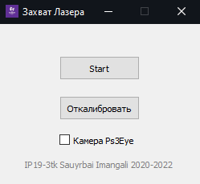
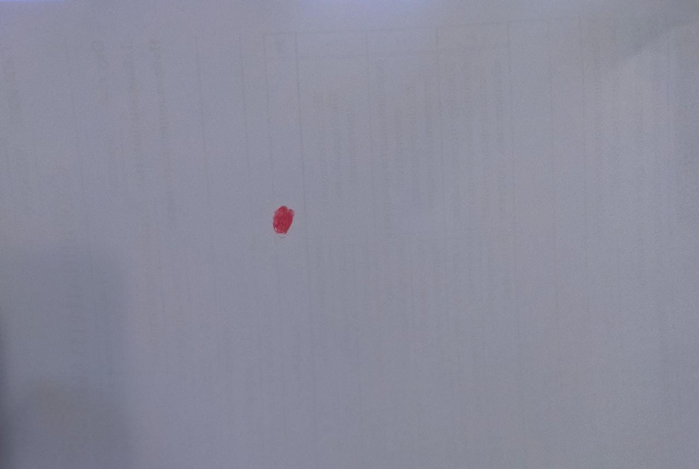
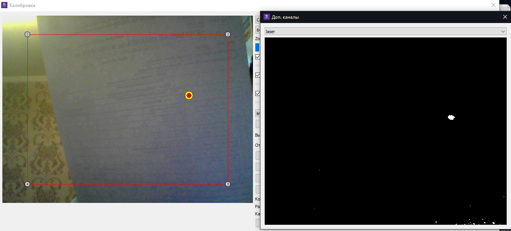
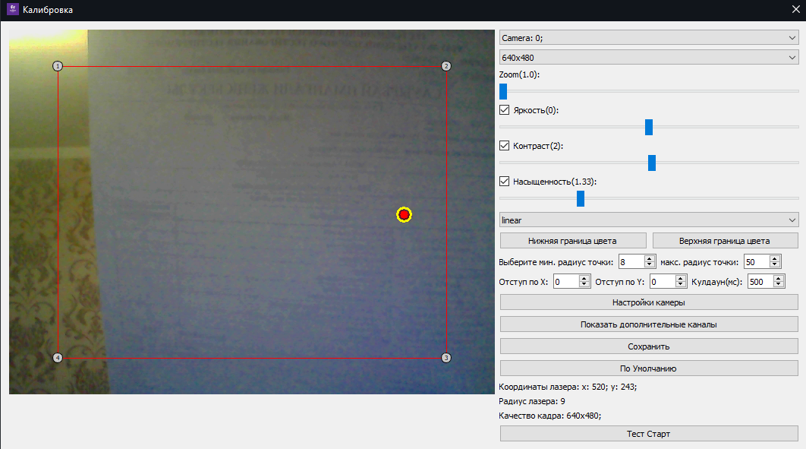

# LaserTarget

LaserTarget is a PyQt application designed to capture laser-generated circles within a defined color range and project them onto a monitor, simulating clicks on screen. It's a handy tool for setting projector boundaries and using a laser pointer for screen interaction.

## Features

- Capture laser-generated circles within a specified color range.
- Project captured circles onto the monitor screen.
- Simulate screen clicks using a laser pointer.
- Configurable settings for color range and projection behavior.

## Screenshots

### Test Subject Photo

### Configuration Screenshots

## Getting Started

### Prerequisites

- Python 3.6+
- PyQt5
- OpenCV
- ps3eye library (compiled from `win_libs` folder)

### Installation

1. Install the required packages: `pip install -r requirements.txt`
2. Compile the ps3eye library from the `win_libs` folder. If you need it.
3. Install PyInstaller from PyPI: `pip install pyinstaller`
4. Go to program’s directory and run: `pyinstaller main.py`
### Usage

1. Run the application: `python main.py` or compiled executable
2. Configure the color range and other settings.
3. Use a laser pointer to generate circles within the color range.
4. Observe the projected circles on the monitor.

## Contributing

Contributions are welcome! If you have any ideas, improvements, or bug fixes, feel free to open an issue or submit a pull request.

## License

This project is licensed under the [MIT License](LICENSE).

---

